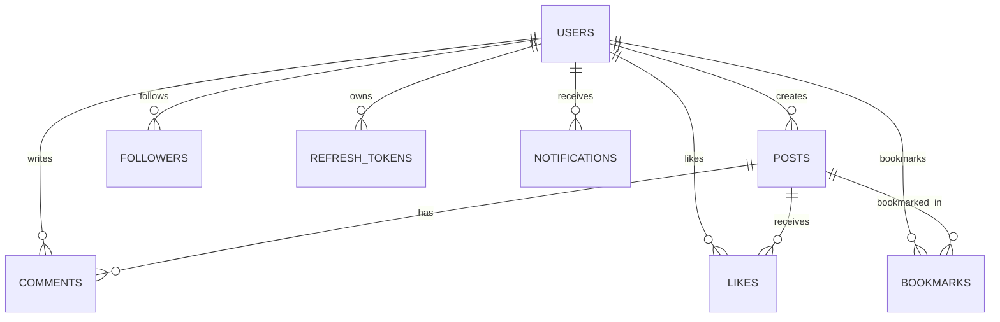

# Nexa — Oracle Social Application (`nexa-oracle-social`)

> **Tagline**: Share. Connect. Discover.

Nexa is a full-stack social media platform engineered specifically for **Oracle Database** (`oracledb` Thin mode), Node.js, Express, TypeScript, React, Vite, and Tailwind CSS.

---

## 1. Architecture Overview

```
nexa-oracle-social/
  ├── database/           # Oracle SQL DDL, PL/SQL reset, seeds & verification
  │   ├── 00_optional_create_user.sql
  │   ├── 01_reset.sql
  │   ├── 02_schema.sql
  │   ├── 03_seed.sql
  │   └── 04_verification.sql
  ├── server/             # Node.js + Express + TypeScript Backend
  └── client/             # React 18 + Vite + Tailwind CSS Frontend
```

### Database Entity-Relationship Diagram



---

## 2. Prerequisites

- **Node.js**: v20+ LTS or v24
- **Oracle Database**: 19c/21c XE or 23c/26ai Free listening on `localhost:1521` (Service e.g. `FREEPDB1` or `XEPDB1`)
- **SQL*Plus**: Installed and on `PATH`

---

## 3. Database Initialization & Execution Order

To set up your Oracle Database instance, run the following SQL scripts in order:

```powershell
# 1. (Optional admin) Create dedicated DB user NEXA_USER
sqlplus sys/your_admin_password@localhost:1521/FREEPDB1 as sysdba @database/00_optional_create_user.sql

# 2. Reset existing schema tables safely
sqlplus NEXA_USER@localhost:1521/FREEPDB1 @database/01_reset.sql

# 3. Apply DDL schema (Tables, Indexes, Foreign Keys, Identity Columns)
sqlplus NEXA_USER@localhost:1521/FREEPDB1 @database/02_schema.sql

# 4. Insert seed data (demo accounts password: Password123!)
sqlplus NEXA_USER@localhost:1521/FREEPDB1 @database/03_seed.sql

# 5. Apply security and privacy tables
sqlplus NEXA_USER@localhost:1521/FREEPDB1 @database/05_security_privacy_migrations.sql

# 6. Run verification suite
sqlplus NEXA_USER@localhost:1521/FREEPDB1 @database/04_verification.sql
```

---

## 4. Environment Setup (`.env`)

## Quick Start & Local Configuration

### 1. Environment Setup

Copy `.env.example` to `.env` in the project root and update credentials for your local Oracle Database instance:

```bash
# Oracle 23c / 26ai Free (default)
DATA_SOURCE=oracle
DB_USER=NEXA_USER
DB_PASSWORD=your_unique_local_oracle_password
DB_CONNECT_STRING=localhost:1521/FREEPDB1

# Oracle 19c / 21c XE
# DB_CONNECT_STRING=localhost:1521/XEPDB1
```
JWT_ACCESS_SECRET=generate_a_unique_random_secret_of_at_least_32_characters
JWT_REFRESH_SECRET=generate_a_different_unique_random_secret_of_at_least_32_characters

---

## 5. Development & Build Commands

```powershell
# Install all dependencies across monorepo
npm install

# Start both backend and frontend concurrently
npm run dev

# Run backend TypeScript typecheck & test suite
npm run typecheck
npm run test
```

---

## 6. Troubleshooting Common Oracle Errors

- **`ORA-12541: TNS:no listener`**: Ensure Oracle listener service (`tnslsnr`) is running on port 1521 (`Test-NetConnection -ComputerName localhost -Port 1521`).
- **`ORA-01017: invalid username/password`**: Check `DB_USER` and `DB_PASSWORD` in `.env`.
- **`ORA-12514: TNS:listener does not currently know of service requested`**: Confirm service name (`FREEPDB1`, `XEPDB1`, or `ORCL`) using `lsnrctl status`.
