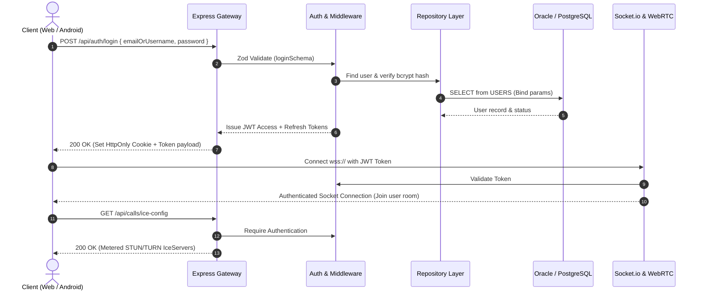

# B.L.A.S.T. Architectural Blueprint & Task Plan
**Repository**: [yaseenyash55-droid/Nexa](https://github.com/yaseenyash55-droid/Nexa.git)  
**System**: Nexa Social Platform (Web, Android, Node.js REST API & Realtime WebRTC/Socket.io)  
**Status**: Architectural Blueprint Awaiting User Confirmation (No Execution Stage)

---

## 1. B — Blueprint (System Overview & Constraints)

### 1.1 High-Level Architecture
Nexa is a full-stack social media application engineered with strict layered boundaries, dual-database compatibility (Oracle Autonomous Database / PostgreSQL with Supabase Pooler), realtime bi-directional communications (Socket.io & WebRTC), and multi-client access (React Vite Web & Native Android Kotlin).

```
                      ┌────────────────────────────────────────┐
                      │              Client Layer              │
                      │  • React (TypeScript + Vite + Tailwind)│
                      │  • Android Native (Kotlin + OkHttp)    │
                      └───────────────────┬────────────────────┘
                                          │ HTTPS / WSS
                                          ▼
                      ┌────────────────────────────────────────┐
                      │              Server Layer              │
                      │  • Express.js + Helmet + CORS + RateLim│
                      │  • Socket.io (Realtime messaging/calls)│
                      │  • Zod Request Validation              │
                      │  • JWT Auth + 2FA / Session Rotation   │
                      └───────────────────┬────────────────────┘
                                          │
                   ┌──────────────────────┴──────────────────────┐
                   ▼                                             ▼
     ┌───────────────────────────┐                 ┌───────────────────────────┐
     │      Database Layer       │                 │   Media & Relays Layer    │
     │  • Oracle 19c/21c / PG    │                 │  • S3 / OCI Object Store  │
     │  • Repository Pattern     │                 │  • STUN / Metered TURN    │
     │  • Parameterized Binds    │                 │  • Brevo HTTP Email API   │
     └───────────────────────────┘                 └───────────────────────────┘
```

### 1.2 Core Architectural Constraints
- **Strict Layering**: Route Handler $\rightarrow$ Validation Middleware $\rightarrow$ Controller $\rightarrow$ Service $\rightarrow$ Repository $\rightarrow$ Database.
- **Dual Database Provider**: Abstract repository interfaces backed by `OracleRepository` and `PostgresRepository`.
- **Zero Raw Dynamic SQL**: Bind variables required across all dynamic queries.
- **Realtime Safety**: All WebRTC signaling and Socket.io events require JWT session verification.

---

## 2. L — Link (Protocols & Data Flow Integration)



---

## 3. A — Architect (System Topology & Schemas)

### 3.1 Backend Routing Topology

The API Gateway routes are mapped under the `/api` prefix in `server/src/app.ts`:

| Route Prefix | Router Module | Responsibilities & Endpoints |
| :--- | :--- | :--- |
| `/api/auth` | [`auth.routes.ts`](file:///y:/Project-folder/nexa-oracle-social/server/src/routes/auth.routes.ts) | Register, Login, 2FA OTP verify, Token Refresh, Logout, `/me`, Password recovery, Email verification. |
| `/api/users` | [`user.routes.ts`](file:///y:/Project-folder/nexa-oracle-social/server/src/routes/user.routes.ts) | Profile retrieval (`/:username`), Profile update, Avatar/Banner upload, Suggestions. |
| `/api/posts` | [`post.routes.ts`](file:///y:/Project-folder/nexa-oracle-social/server/src/routes/post.routes.ts) | Feed generation, Post creation, Post deletion, Comments, Like/Unlike toggle, Bookmark toggle. |
| `/api/social` | [`social.routes.ts`](file:///y:/Project-folder/nexa-oracle-social/server/src/routes/social.routes.ts) | Follow/Unfollow user, Followers list, Following list, Stories publishing & feed, Direct messaging threads. |
| `/api/groups` | [`group.routes.ts`](file:///y:/Project-folder/nexa-oracle-social/server/src/routes/group.routes.ts) | Group chats creation, Member management, Group messaging. |
| `/api/broadcasts` | [`broadcast.routes.ts`](file:///y:/Project-folder/nexa-oracle-social/server/src/routes/broadcast.routes.ts) | Broadcast channel creation, Subscriber broadcast messages. |
| `/api/calls` | [`call.routes.ts`](file:///y:/Project-folder/nexa-oracle-social/server/src/routes/call.routes.ts) | WebRTC calling enablement status, ICE server credentials (`/ice-config`). |
| `/api/notifications`| [`notification.routes.ts`](file:///y:/Project-folder/nexa-oracle-social/server/src/routes/notification.routes.ts) | List user notifications, Mark notification as read, Unread count. |
| `/api/security` | [`security.routes.ts`](file:///y:/Project-folder/nexa-oracle-social/server/src/routes/security.routes.ts) | 2FA management (TOTP setup/verify), Active sessions list, Revoke session, Security logs. |
| `/api/privacy` | [`privacy.routes.ts`](file:///y:/Project-folder/nexa-oracle-social/server/src/routes/privacy.routes.ts) | Account privacy settings (Private account toggle, Story privacy, DM restrictions), Blocked users list. |
| `/api/music` | [`music.routes.ts`](file:///y:/Project-folder/nexa-oracle-social/server/src/routes/music.routes.ts) | Audio track search, Music library listing, Audio attachment to reels/stories. |
| `/api/media` | [`media.routes.ts`](file:///y:/Project-folder/nexa-oracle-social/server/src/routes/media.routes.ts) | S3/Local file uploads, Media signing, Presigned upload URLs. |
| `/api/health` | [`health.routes.ts`](file:///y:/Project-folder/nexa-oracle-social/server/src/routes/health.routes.ts) | Liveness (`/`), Readiness probe (`/ready`), DB connection pool metrics. |

---

### 3.2 Authentication & Security Schemas

All incoming request schemas are validated at the middleware boundary via Zod schemas located in [`server/src/schemas/auth.schema.ts`](file:///y:/Project-folder/nexa-oracle-social/server/src/schemas/auth.schema.ts):

#### 1. Registration (`registerSchema`)
```typescript
{
  username: string (min: 3, max: 30, pattern: /^[a-zA-Z0-9_]+$/),
  email: string (valid email),
  password: string (min: 8, contains uppercase, contains number),
  displayName: string (min: 2, max: 60),
  bio?: string (max: 500),
  location?: string (max: 100),
  websiteUrl?: string (valid URL | '')
}
```

#### 2. Login (`loginSchema`)
```typescript
{
  emailOrUsername: string (min: 1),
  password: string (min: 1)
}
```

#### 3. Two-Factor Authentication (`verifyLoginOtpSchema`)
```typescript
{
  challengeId: string (length: 64 hex/token),
  code: string (pattern: /^\d{6}$/)
}
```

#### 4. Password Reset (`resetPasswordSchema`)
```typescript
{
  token: string (min: 1),
  newPassword: string (min: 8, uppercase, number)
}
```

#### 5. Session Token Structure
- **Access Token**: JWT Signed (HMAC-SHA256), TTL = 15m, Payload: `{ userId: number, username: string, email: string, role: string }`
- **Refresh Token**: Opaque SHA-256 Hashed Token stored in Database `REFRESH_TOKENS` table, TTL = 7 Days, Delivered via HttpOnly, Secure, SameSite Cookie.

---

### 3.3 Frontend Component Tree

The Web Frontend uses React 18 with TanStack Query, React Router v6, and modular component hierarchy:

```
App (Root Provider: QueryClientProvider -> ThemeProvider -> AuthProvider -> BrowserRouter)
│
├── Public Routes (Unauthenticated)
│   ├── LoginPage (LoginForm, LiveAPKDownloadBanner, 2FA Challenge Modal)
│   ├── RegisterPage (RegistrationForm, Input Validation Indicators)
│   ├── ResetPasswordPage (TokenVerifier, PasswordResetForm)
│   └── UserManualPage / HelpPage / Tutorial
│
├── Main Application Layout (AppShell: SidebarNavigation + TopBar + MobileBottomNavigation)
│   │
│   ├── HomePage
│   │   ├── StoriesBar (StoryBubble, StoryCreatorModal, StoryViewerModal)
│   │   ├── PostComposer (MediaUploader, MusicAudioEditor, CameraFilterView)
│   │   ├── FeedTabs (For You, Following, Trending)
│   │   └── PostCard List (PostCard, CommentList, PostOptionsModal, ShareDialog)
│   │
│   ├── ExplorePage & SearchPage
│   │   ├── SearchInput (Debounced autocomplete)
│   │   ├── TrendingTagsList
│   │   └── SuggestedUsersGrid
│   │
│   ├── ReelsPage
│   │   ├── ReelPlayer (Vertical snap-scroll container, VideoControls)
│   │   ├── AudioTrackOverlay
│   │   └── ReelActionSidebar (LikeButton, CommentsDrawer, ShareButton)
│   │
│   ├── ProfilePage
│   │   ├── ProfileHeader (Avatar, Bio, FollowButton, FollowersFollowingModal, EditProfileModal)
│   │   ├── ProfileTabs (Posts Grid, Saved/Bookmarks, Liked)
│   │   └── MediaGrid (Thumbnail preview, Video badge)
│   │
│   ├── MessagesPage (Protected Realtime Chat)
│   │   ├── ConversationsSidebar (Search, Filter, CreateGroupModal, CreateBroadcastModal)
│   │   ├── ChatWindow (Active Chat Header, CallInitiatorButton)
│   │   ├── MessageList (TextMessage, AudioMessage, MediaMessage, StatusIndicators)
│   │   ├── MessageInputBar (VoiceRecorder, AttachmentPicker, SendButton)
│   │   └── CallModal (WebRTC Audio/Video Screen, Call Controls, Remote Video)
│   │
│   ├── NotificationsPage (NotificationItem, FilterChips, MarkAllReadButton)
│   │
│   └── SettingsPage (Tabbed Navigation)
│       ├── Tab: Appearance (ThemeSettingsModal, Contrast options)
│       ├── Tab: Protection & Privacy (ProtectionCenterPage, 2FA Toggle, SessionsManager)
│       ├── Tab: Bookmarks (Saved posts list)
│       ├── Tab: Creator Insights (CreatorInsightsPage, Analytics graphs)
│       └── Tab: Moderation Queue (ModerationQueuePage, Report Review)
│
└── Fallback: NotFoundPage
```

---

## 4. S — Stylize (Design System & Aesthetics)

- **Color System**:
  - Dark Mode Canvas: `#0b0f19` (Deep Navy)
  - Surface Background: `#151e2e` (Graphite Slate)
  - Primary Brand Accent: `#6366f1` (Indigo Violet)
  - Secondary Accent: `#06b6d4` (Cyan Glow)
  - Destructive / Alert: `#ef4444` (Crimson)
- **Typography**:
  - Primary Sans: `Inter, -apple-system, BlinkMacSystemFont, 'Segoe UI', Roboto, sans-serif`
  - Monospace (Code/Tokens): `JetBrains Mono, 'Fira Code', monospace`
- **Responsive Layout**:
  - Mobile Shell: `360px - 767px` (Bottom Navigation Bar active)
  - Tablet Shell: `768px - 1023px` (Collapsed Icon Sidebar)
  - Desktop Shell: `1024px+` (Full Sidebar Navigation + Auxiliary Widgets)

---

## 5. T — Trigger (Execution & Verification Matrix)

When architectural approval is granted, the following triggers govern execution:

1. **Type Safety Trigger**:
   ```bash
   npm run typecheck
   ```
2. **Unit & Integration Test Suite Trigger**:
   ```bash
   npm run test
   ```
3. **Production Build Compilation Trigger**:
   ```bash
   npm run build
   ```
4. **Runtime Healthcheck Trigger**:
   - `GET /api/health` $\rightarrow$ Status: `ok`
   - `GET /api/health/ready` $\rightarrow$ Database connectivity confirmed.

---

> [!NOTE]
> **Blueprint Status**: Architectural planning is complete and documented. No code modifications will be triggered until the user reviews and confirms this architectural blueprint.
